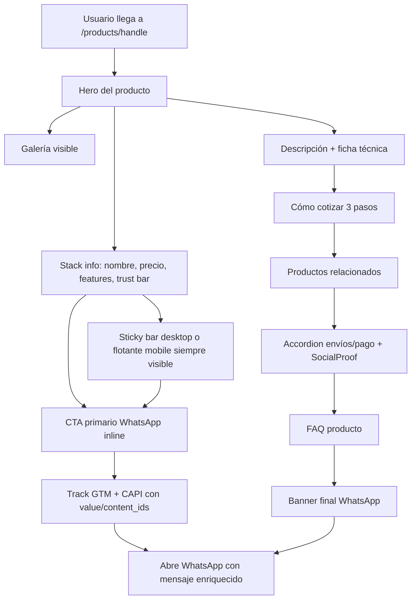

## 1. Diagnóstico actual (top issues de conversión)

Página actual `src/app/products/[handle]/page.tsx`:

- **CTA único es flotante** (`WhatsAppButton`) y solo aparece tras `scrollY > 220`. No hay CTA visible junto al precio above-the-fold.
- **Información crítica enterrada en accordion** al final (envío, métodos de pago, tiempo de fabricación). Estas son objeciones que deberían resolverse antes del CTA.
- **Reel** (`src/app/components/Reel.tsx`) muestra 3 videos genéricos (2 duplicados) de un CDN Shopify ajeno, ocupando `min-h-screen` y rompiendo el flujo de compra.
- **Reviews** (`src/app/components/Reviews.tsx`) son 22 reseñas hardcodeadas con imágenes externas de otra tienda Shopify. Hostil a credibilidad si el usuario las inspecciona.
- **Descripción genérica autogenerada** sin specs, bullets ni diferenciadores.
- **Mensaje WhatsApp prellenado pobre**: `"Hola, quiero cotizar el producto X"`. No incluye link, precio, id, ni datos que aceleren la respuesta del equipo.
- **Sin productos relacionados**: si no convierte, el usuario sale.
- **Sin SEO ni structured data por producto** (afecta también a la preview cuando se comparte por WhatsApp).
- **Tracking limitado**: solo botón flotante; sin `value`, `currency`, `content_ids`. La API CAPI de `[src/app/api/facebook-whatsapp/route.ts](src/app/api/facebook-whatsapp/route.ts)` ya soporta `value`, `currency`, `content_ids`, `content_name` pero el cliente no los envía.
- **Botón "Volver"** apunta a `/` (no a la categoría/colección de donde vino).
- **Duplicado `mb-10`** en el `h1` y CSS inconsistente con el resto del sitio (tipografía `font-light` del resto vs. `font-bold` aquí).

## 2. Orden de ejecución y priorización (PIE)

Alta prioridad (cambian conversión hoy):
- T1, T2, T3, T4, T5 — Hero del producto con CTA above-the-fold + trust bar + mensaje prellenado enriquecido + tracking completo.

Media prioridad (credibilidad y exploración):
- T6, T7, T8, T9 — Ficha técnica, prueba social real, productos relacionados, eliminar Reel.

Baja prioridad pero importante (SEO/UX):
- T10, T11, T12 — Metadata + structured data, breadcrumb, limpieza.

## 3. Cambios por archivo

### T1. Extender el schema `Product` con campos opcionales

Archivo: `[src/data/products.ts](src/data/products.ts)`.

En la interfaz `Product` (líneas 35-43) agregar campos opcionales sin romper los productos existentes. Agregar después de `handle`:

```ts
export interface Product {
  id: string;
  name: string;
  price: number;
  category: string;
  description?: string;
  imageUrl?: string;
  handle?: string;
  shortPitch?: string;
  features?: string[];
  dimensions?: { width?: string; depth?: string; height?: string; diameter?: string };
  material?: string;
  finish?: string;
  productionDays?: number;
  inStock?: boolean;
  stockNote?: string;
}
```

No completar productos: el render usará fallbacks. Solo dejar el schema listo y los comentarios del archivo (líneas 1-33) actualizados con los nuevos campos opcionales.

### T2. Helper de WhatsApp y mensaje prellenado enriquecido

Crear `src/lib/whatsapp.ts` con:

- Constante `WHATSAPP_PHONE = "56995497838"`.
- Función `buildProductWhatsAppMessage(product, origin)` que arme un mensaje multilínea con: saludo, nombre, precio formateado, link absoluto (`${origin}/products/${handle}`), id como referencia interna.
- Función `buildWhatsAppUrl(message)` que devuelva la URL `https://wa.me/...?text=...` con `encodeURIComponent`.
- Función `formatCLP(price)` reutilizable.

Ejemplo de mensaje generado:

```
Hola Idea Madera 👋
Me interesa cotizar: Mesa Centro Roma
Precio referencia: $359.990
Link: https://ideamadera.cl/products/mesa-centro-roma
Ref: mesa-centro-roma
```

Migrar a usar este helper:
- `[src/app/components/WhatsAppButton.tsx](src/app/components/WhatsAppButton.tsx)` (líneas 58-63).
- `[src/app/components/ProductCard.tsx](src/app/components/ProductCard.tsx)` (líneas 17-21).
- Los nuevos CTAs inline que se agregan en T3.

### T3. Rehacer `[src/app/products/[handle]/page.tsx](src/app/products/[handle]/page.tsx)` con layout de PDP optimizada

Estructura nueva (mobile-first, replicando estética `font-light` del resto del sitio):

```
[Breadcrumb compacto: Inicio / {category} / {name}]

[Sección hero del producto]
  Grid lg:grid-cols-2
    Izquierda: ProductGallery (sin cambios)
    Derecha (sticky en lg): 
      - eyebrow: categoría
      - h1 nombre
      - rating compacto ("4.9 · basado en clientes verificados")
      - precio grande
      - shortPitch (1-2 líneas) o fallback corto
      - features[] como bullets con check (si existen) — máx 4
      - CTA primario inline "Cotizar por WhatsApp" (verde WhatsApp, full-width en mobile)
      - CTA secundario "Llamar" (tel:+56995497838)
      - Trust bar 2x2: Envíos a todo Chile · Fabricación {productionDays || 15} días · Cambios 30 días · Pago tarjeta/transferencia
      - Línea sutil de urgencia honesta: "Respondemos en menos de 1 hora hábil"

[Descripción larga + Ficha técnica]
  Si product.description → mostrar
  Si product.dimensions / material / finish → tabla limpia
  Si no → fallback genérico actual

[Cómo cotizar — 3 pasos] (reutiliza estilo de /peldanos-a-medida)

[Productos relacionados] (T8)

[Accordion existente] (envío, pago, etc — pasa a quedar más arriba, antes del FAQ general)

[Prueba social real] (T7)

[FAQ del producto / contacto]

[CTA banner final oscuro con WhatsApp]
```

Eliminar:
- `import Reel from "@/app/components/Reel"`.
- Bloque `<Reel videoUrls={[...]} />` (líneas 133-139).
- El `mb-10` duplicado en el `h1` (línea 93).
- Reemplazar `font-bold` por `font-light` para alinear con el resto del sitio.

Server component: mantener `async`. Generar `origin` desde `headers()` (`x-forwarded-host` + `x-forwarded-proto`) o usar `NEXT_PUBLIC_SITE_URL` si está; fallback a `https://ideamadera.cl`. Pasar `origin` a los componentes cliente vía props.

### T4. Rehacer `[src/app/components/WhatsAppButton.tsx](src/app/components/WhatsAppButton.tsx)`

Cambios:
- Color verde WhatsApp (`bg-[#25D366]` con texto blanco) — reconocible globalmente y +CTR vs. botón oscuro.
- En desktop (lg+): no usar `fixed bottom-4`; en su lugar mostrar como **sticky bar inferior compacto** con `flex justify-between`: a la izquierda nombre del producto + precio; a la derecha el botón.
- En mobile: mantener flotante centrado.
- Recibir prop `priceLabel?: string` y `imageUrl?: string` para enriquecer el sticky bar.
- Recibir prop `productId?: string` y `productPrice?: number` para enviar al CAPI:

```ts
await fetch("/api/facebook-whatsapp", {
  method: "POST",
  body: JSON.stringify({
    event_name: "MensajeWhatsApp",
    event_source_url: window.location.href,
    content_name: productTitle,
    content_ids: productId ? [productId] : undefined,
    content_type: "product",
    value: productPrice,
    currency: "CLP",
  }),
});
```

- DataLayer event ampliado: `{ event: "whatsapp_click", product_id, product_name, value, currency, placement: "sticky" | "inline" | "banner" }`.
- Aparecer desde `scrollY > 80` (no 220) — pierde la primera vista pero gana early visibility.
- Agregar `aria-live="polite"` y `role="region"`.

### T5. CTA inline reutilizable

Crear `src/app/components/WhatsAppInlineCTA.tsx` (cliente):

- Props: `productTitle`, `productId`, `productPrice`, `placement` ("inline" | "banner"), `variant` ("primary" | "secondary"), `label?`, `fullWidth?`.
- Mismo tracking que T4 (GTM + CAPI), reutiliza helper de T2.
- Variantes visuales:
  - `primary`: verde WhatsApp, ícono, full-width opcional.
  - `secondary`: borde oscuro, fondo blanco, ícono verde.

Usar en: hero del producto (primary, fullWidth en mobile), banner final (primary), tarjetas de "cómo cotizar" si aplica.

### T6. Ficha técnica + features

Dentro de la PDP, justo bajo la descripción larga:

```tsx
{(product.features?.length || product.dimensions || product.material || product.finish) && (
  <section className="mx-auto w-full max-w-3xl border-t border-neutral-200 pt-6">
    <h2 className="text-xl font-light tracking-tight mb-4">Detalles del producto</h2>
    ...lista de features con check + tabla de specs simples (label · valor)
  </section>
)}
```

Si no hay datos, no se renderiza nada (no muestra placeholders vacíos).

### T7. Reemplazar `[src/app/components/Reviews.tsx](src/app/components/Reviews.tsx)` por `SocialProof.tsx`

Crear `src/app/components/SocialProof.tsx`:

- Bloque sobrio con:
  - Headline "Clientes que ya confiaron en nosotros".
  - Rating agregado mock honesto: "4.9 · 200+ clientes en Chile" (números basados en el negocio real, sin inventar reseñas).
  - 3 highlights cortos en cards (sin imágenes externas, sin nombres falsos): "Atención por WhatsApp", "Fabricación propia", "Envío a todo Chile".
  - Logos/menciones si los hay (placeholder slot opcional con prop `partners?: string[]`).
- Sin datos hardcodeados de personas inventadas.

Eliminar `[src/app/components/Reviews.tsx](src/app/components/Reviews.tsx)` (archivo completo) y todas sus referencias:

```bash
rg "from \"@/app/components/Reviews\"" -l
```

Reemplazar import por `SocialProof` donde aplique (PDP y, si está en Home, también).

### T8. Productos relacionados

Crear `src/app/components/RelatedProducts.tsx` (server component):

- Props: `currentProductId`, `category`, `limit = 4`.
- Lógica: filtrar `products` por misma categoría, excluir el actual, mezclar con un seed determinístico basado en el id (para SSR estable), tomar `limit`.
- Render: grid responsive de 2 cols en mobile / 4 en desktop. Reutiliza `ProductCard` existente.
- Headline: "También te puede interesar".

Usar al final de la PDP, antes de `Accordion`/SocialProof/FAQ.

### T9. Eliminar `Reel`

- Borrar `[src/app/components/Reel.tsx](src/app/components/Reel.tsx)`.
- Verificar que `swiper` siga siendo dependencia necesaria con `rg "from 'swiper" -t ts -t tsx`; si no lo usa nadie más, quitar de `package.json` (no instalar nada nuevo; solo dejar nota si se elimina).

### T10. Metadata dinámica + structured data (Product schema)

En `[src/app/products/[handle]/page.tsx](src/app/products/[handle]/page.tsx)` agregar:

- `export async function generateMetadata({ params })` que devuelva:
  - `title`: `${product.name} | Idea Madera`
  - `description`: `product.shortPitch ?? product.description ?? fallback`
  - `openGraph.images`: `productImagesById[id]?.[0] ?? product.imageUrl`
  - `alternates.canonical`: `/products/${handle}`
- JSON-LD `Product` schema en el cuerpo del componente (siguiendo el patrón ya existente en `[src/app/peldanos-a-medida/page.tsx](src/app/peldanos-a-medida/page.tsx)` líneas 47-103):
  - `@type: Product`, `name`, `image`, `description`, `sku: id`, `brand`, `offers` con `priceCurrency: "CLP"`, `price`, `availability`.
- Generar `generateStaticParams()` para mejorar build y SEO.

### T11. Breadcrumb con retorno contextual

Reemplazar el botón "Volver" (líneas 78-91) por un breadcrumb compacto:

```tsx
<nav aria-label="Breadcrumb" className="text-xs tracking-wide text-neutral-500">
  <ol className="flex items-center gap-1.5">
    <li><Link href="/">Inicio</Link></li>
    <li>/</li>
    <li><Link href={`/?cat=${encodeURIComponent(product.category)}`}>{product.category}</Link></li>
    <li>/</li>
    <li className="text-neutral-900">{product.name}</li>
  </ol>
</nav>
```

Bonus (si simple): en `[src/app/page.tsx](src/app/page.tsx)` leer `?cat=` con `useSearchParams` en un Suspense para pre-seleccionar el filtro al volver — opcional, dejar como follow-up si toma tiempo.

### T12. Limpieza menor

- Eliminar `import Reel` y referencia.
- Sustituir `font-bold` por `font-light` en h1/h2 de la PDP para coherencia con el resto.
- Quitar `mt-10 mb-10 mb-8` redundantes del `h1` actual.
- Sustituir `text-3xl md:text-4xl font-bold` del precio por `text-3xl md:text-4xl font-light tracking-tight`.

## 4. Mapa visual del flujo nuevo (PDP)



## 5. Definition of Done

- [ ] CTA WhatsApp visible above-the-fold en mobile sin scroll.
- [ ] Sticky bar con precio + CTA en desktop (lg:) siempre visible.
- [ ] Reel eliminado; Reviews reemplazado por `SocialProof` sobrio sin datos falsos.
- [ ] Mensaje prellenado de WhatsApp incluye nombre, precio, link absoluto, id.
- [ ] CAPI envía `value`, `currency`, `content_ids`, `content_name`, `content_type`.
- [ ] DataLayer event incluye `placement` para diferenciar CTAs.
- [ ] Schema `Product` extendido sin romper productos existentes; PDP renderiza sin errores cuando faltan campos nuevos.
- [ ] `generateMetadata` y JSON-LD Product activos por producto.
- [ ] Productos relacionados (4) al final, misma categoría, excluyendo el actual.
- [ ] Breadcrumb reemplaza el "Volver" actual.
- [ ] `npm run lint` y `npm run build` pasan sin nuevos warnings.

## 6. Out of scope (sugeridos como follow-up)

- A/B test real con flag (requiere infra fuera de este alcance).
- Captura de email como segundo lead alternativo a WhatsApp.
- Filtros del Home pre-seleccionados desde el breadcrumb (`?cat=`).
- Llenar `features`/`dimensions` de cada producto (requiere data del negocio).
- Reemplazar HeroBanner del Home (imagen Shopify externa) — fuera del scope PDP.